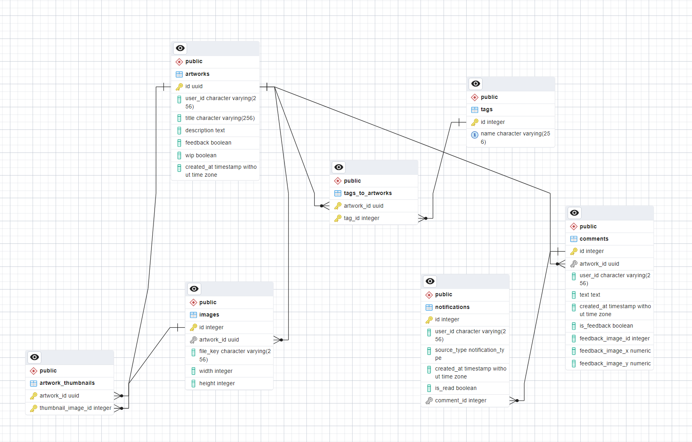

# Artapp (SE_05 Relational Databases Module Assessment)

Deployed at [https://duetart.vercel.app/](https://duetart.vercel.app/)

This project is mean to be a platform for artists to share their work and receive feedback. It lets you upload artworks with some details and share your portfolio with others. You can leave comments and feedback directly on images and see a canvas view of the uploaded art.

Here are some use cases for the app:

- Upload your artwork with metadata like tags and description
- View recently uploaded artworks by others
- Leave comments and feedback on artworks, including on specific spots within images
- View a users artwork on their portfolio page

## Getting Started

First, run the development server:

```bash
npm install
npm run dev
```

The project requires the following services:

- Postgres managed with Neon DB (can be changed for another postgres instance fairly easily by switching the drizzle adapter in src/db/index.ts, see [here](https://orm.drizzle.team/docs/quick-postgresql))
- Clerk for authentication
- Uploadthing for image uploads
- TwicPic for image optimization

To set these services up, copy the env.template, rename it to .env and enter the keys.

Open [http://localhost:3000](http://localhost:3000) with your browser to see the running website.

## ER Model


## Contribution List
- Created a model with multiple complex relationships for a real use case with postgres
- Iteratively improved the schema to allow for additional features, proper normalization and
future proofing
- Implemented the database connection with queries and updates in a web project
- Used drizzle as an ORM to work with the queried data within a typescript project
- Used drizzle as a query builder as well as raw sql to perform migrations and to query
and modify the data
